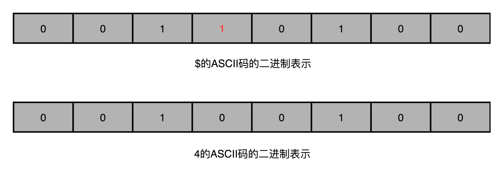

# ECC内存与单比特翻转

## 前言

> 不管是硬盘还是内存，还可以继续细分，会存在普通版和企业版，相应的性能也是不一样的。
>
> 当然，设备之间操作的是数据，那么普通版硬件就会更可能出现问题，如单比特翻转。
>
> 企业版就会更加可靠，可靠代表的是硬件和软件层面避免了一些错误的发生，比如常见的奇偶校验。

只知道了简单的硬件知识，其实还不够，还需要知道不同的硬件，不同的应用环境，对应不同的技术方案！

## 正文

>本文需要具备的基础知识：知道内存这个硬件，知道一些常见的数据校验方式，知道二进制数据和字符编码，了解服务器硬件与普通硬件。

### 一、常见硬件分级

普通的硬件，一般就是常见的内存条，HHD硬盘，SSD硬盘......

对于数据中心，服务器集群，使用的硬盘是企业级硬盘，ECC纠错服务器内存条....，也可以直接使用Dell这样大厂的整套服务器解决方案。

### 二、单比特翻转

顾名思义，单比特翻转就是描述的是：**一个比特的数据变了。**

由于比特只能代表开闭两种状态，所以要么是1变0，要么0变1.

大家都知道的字符编码，是将显示的字符与文字全部映射为一个一一对应的二进制数据串，一般Win的GBK编码占用内存20多MB。

所以，**只要数据串中的任何一个比特改变了，对应字符串表示的信息就差了千里，尤其是进行数据运算的时候，一个比特改变，就会直接变成一个很大的数，或者就直接不是数字了，那么继续运算必然会出错。如下的4变成了$。**

而这个翻转，就是一个错误，并且这个错误会直接让计算错误，属于硬件故障，关键还是随机发生。使用Hadoop集群计算的时候，一旦出现硬件故障，就会重试，那么这个重试机制有点太骨感了，需要一种避免硬件故障的方式。

### 三、ECC内存

**EEC内存，全称Error-Correcting Code memory，俗称纠错内存。**

作为一种企业级的解决方案，ECC做的就是保证出现硬件故障时候，数据的纠错与矫正，这个技术一定是使用某种算法实现的，并且时间复杂度一定不能高！

### 四、奇偶校验

在学习微机原理的时候，一定说过关于奇偶校验这个事，并且在数据传输的时候也会有类似的机制，如：MD5校验哈希值，SHA校验值，循环冗余编码（CRC）的校验文件。

**奇偶校验，属于最简单避免数据错误的方式，本质就是根据数据串中1的个数，是偶数就在校验码位写入1，是奇数就在校验码位写入0。**

**对于整个数据串，只是增加了一个单独的校验位，空间复杂度不高；**

**对于校验的时间，只是遍历一遍整个数据串，时间复杂度也不高，O(n)。**

**奇偶检验只能校验单个数据为的更改，如果更改了两位，就检测不到，起不了效果；**

**奇偶校验，只能发现数据更改了，不能知道数据哪里更改了，也就是不可做到纠错，只能做到检测到错误，停止运行。**

### 五、纠错码（Error Correcting Code）与纠删码（Erasure Code）

纠错码就是将数据的错误信息检测到，并且可以矫正发生的错误。

纠删码就是将数据的错误纤细检测到，矫正发生的错误，如果矫正失败就直接删除数据。

上述这两个技术广泛应用于ECC内存，网络传输，硬盘的RAID。

## 结束语

关于ECC内存和单比特翻转的基本介绍，其实很简单，关键在于知道这个问题，了解它。

以后遇到类似的问题可以直接想到，并且知道如何解决，这也算是只是的积累过程。

关于纠错码与纠删码，更加的偏向于算法，并且这都是一个非常巧妙的实现方式，可不是拍脑袋想出来的。

## 参考链接

1.Cyclic redundancy check：https://en.wikipedia.org/wiki/Cyclic_redundancy_check

