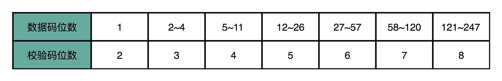
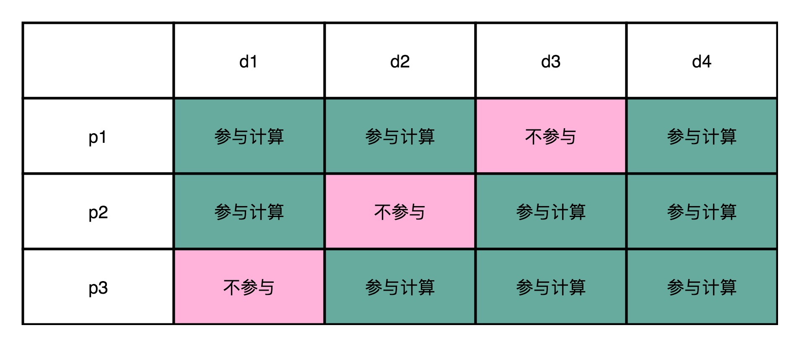
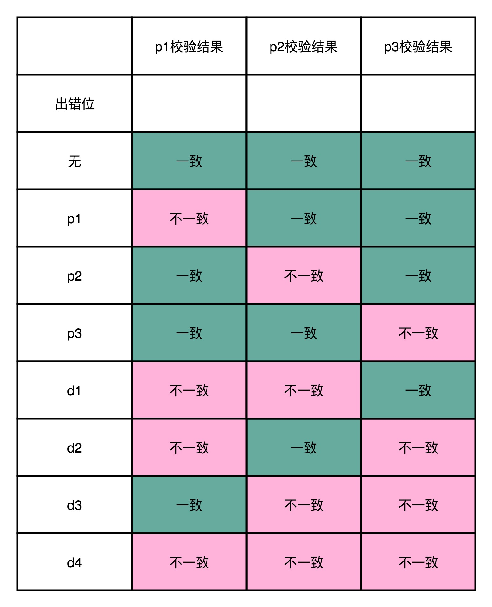
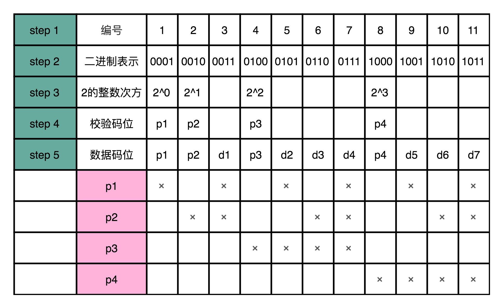
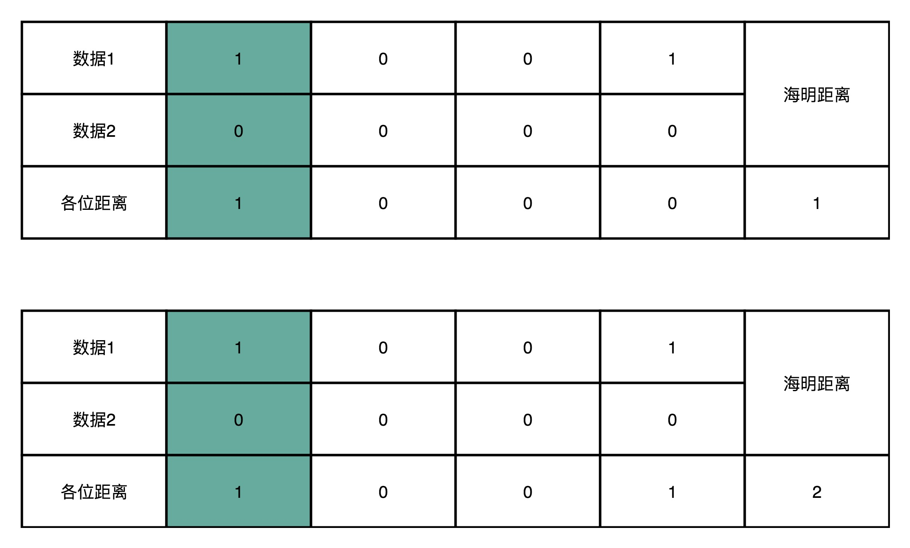
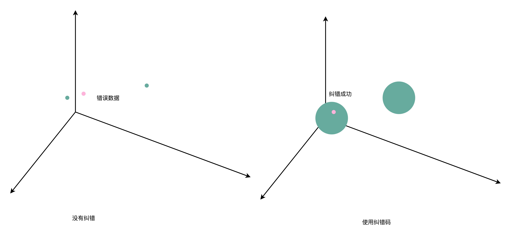

# 纠错码之海明码

## 前言

> 在[ECC内存与单比特翻转](https://www.copydays.org/2020/06/06/ecc内存与单比特翻转/#ECC内存与单比特翻转)中，介绍过数据的一致性问题，也给出了奇偶校验这种检错的方式，但是该方法只可以给你说错了，并不能表示错哪里了，所以这种方式叫做检错码（Error Detecting Code）。

这篇文章将从一个最基础的纠错码的实现案例出发，看看如何实现数据的检错与纠错。其广泛应用于目前的ECC内存中。

## 正文

>本文需要具备的基础：了解基础的数据一致性问题，硬件的单比特翻转问题，熟悉二进制表示，对于逻辑有所掌握！
>
>推荐首先阅读：[ECC内存与单比特翻转](https://www.copydays.org/2020/06/06/ecc内存与单比特翻转/#ECC内存与单比特翻转)。

### 一、海明码（Hamming Code）

海明码是图灵奖得主Richard Hamming（理查德 海明）发明的，至今还在使用。

**一个基础的海明码是：7-4海明码。**

**其中，7指的是实际有效的数据位数，4指的是额外存储的4位数据，用来纠错。**

**一般的纠错码，只能纠错一位数据的错误，多位数据的纠错还不能实现**，一位数据的出错已经是非常小的概率了，还会出现两位，这个运气已经远远超过买彩票了，毕竟彩票总数也可就是数亿张，出现单比特翻转已经是亿亿次的概率了。

**注意：想要检错和纠错，多余的数据位是不能摆脱的，所以数据肯定是冗余的。**

### 二、数据位与校验位关系

使用海明码的时候，数据位的选择和校验位的选择其实是有一个区间的，并不是一一对应的关系。

**一般的数据位K，与校验位N之间的关系：**

**K+N+1 = 2^N**

注意：我们是使用校验位进行数据位的校验，不只是数据位会出现单比特翻转，**校验位也会出现单比特翻转**，所以数据位的随机组合情况必然需要大于等于数据位和校验位的总和。

数据位和校验位的数量对照表如下：

### 三、海明码纠错原理

> 关于纠错原理，只需要知道两件事：1）校验位是如何计算的，2）校验位不一致如何反推出哪一位错误了。

使用简单地4-3海明码描述整个海明码的纠错原理。

d表示数据位，data bits；p表示校验位，parity bits。

#### 1）计算校验位

将数据位中的某一位取出，计算剩余位，饿到校验位。

#### 2）校验位反推数据位

已经得到了初始值的校验位，在实际数据计算的时候，需要先进性数据的校验，那么将即将需要计算的数值，重新按照计算方式获得校验位。

新计算的校验位与存储的校验位进行比较，可以得到校验位的校验结果真值表。

当，只要某一个校验结果不一致的时候，就是那个不一样的校验位错了。

当，有两个校验结果不一致的时候，可以确定唯一的一个数据位错误。

### 四、海明码生成规则

知道了海明码是怎么进行数据位与校验位的纠错，那么对于任何一个数据位-校验位的组合，是如何得到新的海明码呢？

一般会有下面这几步：

1）明确数据位和校验位是多少，比如7-4海明码；

2）对所有的位（数据位+校验位）排序，计算二进制；

3）将二进制中是2的幂的位，作为校验位，如：1、2、4、8；

4）将剩下的数据位，按照二进制从左到右的顺序分类，如最左边是1，归为一类，作为校验位的第一位计算的数据源；最左边的右边一位，归为另一类，作为校验位的第二位计算的数据源......

### 五、海明距离

海明距离在学习二进制表示的时候，提说过，其描述的是：**两个二进制数不相同数据的位数的个数。**

使用海明码，需要保证错误的数据到正确的数据之间的海明距离是1，这样才可以纠错一位错误的数据。

任何两个实际传输的数据，海明距离都至少要是3，并且不能是2。需要保证数据纠错之后，只有唯一的正确数据与之对应。

此时就可以将整个纠错使用海明距离表示，不同想数据球之间要有3个单位的海明距离，任何一个数据求的半径都是1。

## 结束语

关于学习海明码这种实现纠错码的方式，只需要知道纠错原理，明白二进制的经典表示用法就可以了。

尤其是校验位组合之后的反推数据中哪一位的出错，是一个非常不错的思路！

在计算机中，就不要想使用十进制，多用二进制，尤其是二进制的每一位的数字特点，这是很多基础进制运算的实现突破点。

关于纠错和纠删码的内容，参考文末的参考链接，阅读愉快！

## 参考链接

1.Erasure code：https://en.wikipedia.org/wiki/Erasure_code

2.Hamming code：https://en.wikipedia.org/wiki/Hamming_code

