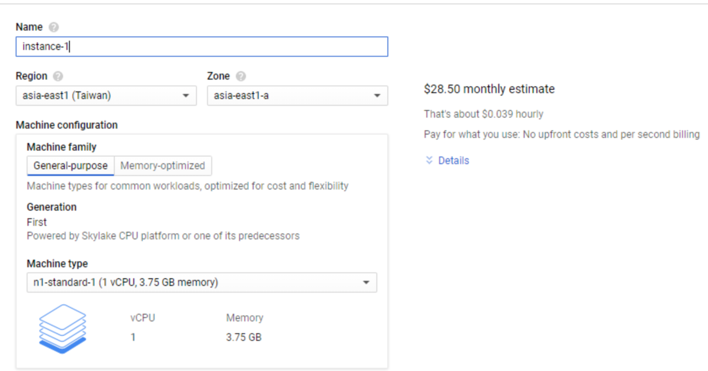
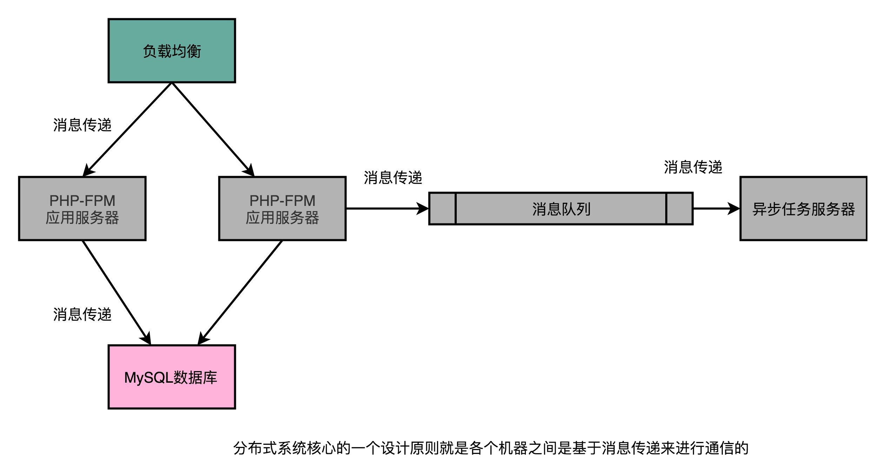
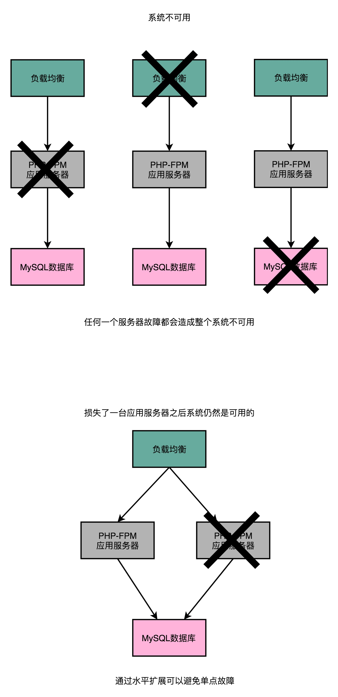
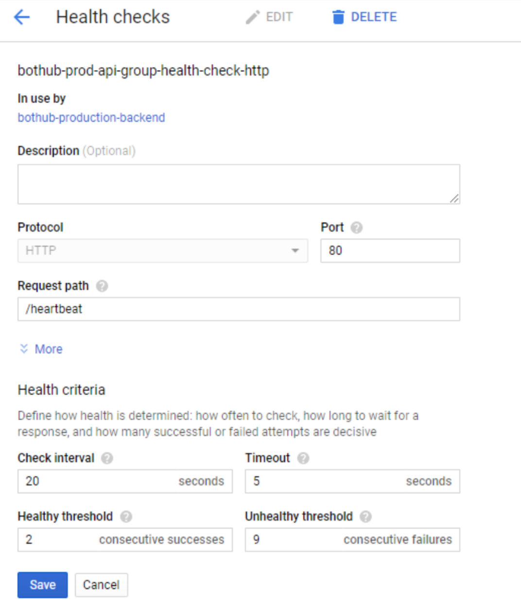

# 分布式计算之高可用

## 前言

> 关于分布式和微服务的内容，已经是现在互联网服务的标配，曾经在赵成老师运维管理体系课程中，了解到一个系统最小的单元是一个个拆分出来的服务。而对于整个系统，需要保证的是服务的高可用，不再是一个大大的瓜--系统高可用。
>
> 使用具体的服务将系统拆分，更加具体的描述了系统的特定与组成。

在分布式中，有很多新的概念出现，这不同于单体服务，会涉及垂直扩展和水平扩展的选择，还有系统的设计与水平扩展能力，并且运维同学的5个9（99999），也不是吹出来的，那么系统的高可用如何保障，对于业务数据的一致性如何保证.......

这些都涉及**硬件是否故障，系统设计是否合理.......**

## 正文

>本文的阅读门槛：知道基本的服务器知识，知道CAP理论，知道影响高可用的基本要素，懂得应用的部署等。
>
>还需要懂得，性能的提升是一个永恒的话题！

### 一、性能的追求

随着科技的发展，单体应用基本上不存在了？(我的blog网站就属于单体。)

对于性能的追求，永远不停歇，一般的互联网公司，体量大，必然需要更高的性能，不管是硬件还是软件层面都是需要的。

因为，**性能高了就可以省钱，省事，省人**，哈哈！

所以，一旦面试官问你的问题比较含糊，有关性能的，就直接向性能方面靠，因为性能考验的是全局的调配能力，能力等级层次就直接不一样了！

### 二、单体应用

在服务器部署应用的时候，是选择1个CPU的还是2个CPU，是4GB的内存还是10GB的内存，是10GB的硬盘还是100GB的硬盘，这些选择都只是启动了一个实例。

**这个实例，就是一个虚拟服务器，是一个固定地区，固定机房，固定机柜，固定宿主服务器的服务器。（一个物理服务器会有多个实例，多个宿主）**

当应用部署在服务器之后，此时将这个系统称为单体应用。

### 三、垂直扩展（Scale up）

在单体应用的基础上，部署的服务器需要提供更大的服务体量之后，就需要扩展了。

**最简单，最直接的方式就是：升级原本的服务器配置。**

**1核心CPU的升级为4核心CPU；10G内存升级为20G内存；100GB硬盘升级为2TB硬盘。**

此时整个服务就可以提供更大的算力，提供更多的服务能力了。

垂直扩展的好处就是，不需要研发成本，直接升级，重新启动服务即可，简单便捷。

### 四、水平扩展（Scale out）

水平扩展，最形象的表现就是，一个水桶装不下，多来几个水桶装。

**对应于服务器就是：不升级原本的服务器，再买一个服务器。**

此时就有了两个服务器了，那么据需要额外的软件设计了：分布式的能力，负载均衡（load Balancer）策略，拆分应用服务器和数控服务器，应用之间的消息队列等。

**这里使用消息传递（message Passing）的水平扩展，而不是使用共享内存（Shared Memory）的垂直扩展，也对应于操作系统中的信号量，进程之间的通信，是使用信号还是使用共享内存。**

**注意：任何一个系统的最终命运都是，使用水平扩展提供更高的性能与可用性。**

### 五、高可用（Hight Avaiabiliy）

由于最终的硬件系统扩展方案都会是水平扩展，那么如何描述高可用，使用什么进行量化呢？

**系统的可用性描述为：系统可以正常服务的时间占比。**

一般影响服务正常的事件会有：升级系统，软件崩溃了，硬件设备坏了，机房断电了，数据中心断网了，自然灾害等。

其中，**将自己主动控制服务不可用，如升级服务，称为计划内停机时间（Scheduled Downtime）。没有在计划之内的，外部因素导致的停机，叫做计划外停机时间（Unscheduled Downtime）。**

在实际量化计算的时候，使用每一个服务器的可用性相乘作为整个系统的可用性，如：

**90% * 90% * 90% = 99.97%**

**90% * 90% * 90% * ..（一共1000个90%）.. 90% * 90% * 90%  =  90.5%**

**这就是大家都是到的一个道理：当多个0.99相乘，当数量非常大的时候，一定会出现0.6或者更小的数值，这就是最不想看到的结果。**

此时的服务情况，由于当机器数量多了，就会出现各种问题，也就是各种不可用。

### 六、单点故障（Single Point of Failure）

单点故障，描述的是：任何一台服务器出错了，整个系统就没法使用。

解决单点故障的常见做法是：水平扩展。

使用两个机器提供相同的功能，一旦某个机器宕机，还可以使用另一个机器顶住，下图可以更加直观的描述。

**单点故障本身，其实并不只是服务器本身，还有当前服务器对应的机架（Rack），还有机架之间的交换机（Switch），还有存放的IDC机房或数据中心。**

下图可以详细的看看每一个服务器的安置环境。

### 七、故障转移（Failover）之健康检测（Health Check）

在知道了垂直扩展，水平扩展和高可用之后，想要系统实现水平扩展的高可用还需要一套机制：故障转移机制。

**在某一个服务器出现故障之后，可以及时发现，并且将故障机器从整个服务器集群的注册中心移除，使其不再进行负载均衡中请求的分配。**

一般故障发现，可以使用健康监测实现，也就是一个类似于心跳的机制。定时发送空的数据包，监测是否机器还活着，如果机器挂了，就直接启动故障转移。

**心跳机制，不只是存在于微服务之间，还存在于手机与服务的连接中。比如，微信，微波等。**

使用故障转移的触发机制之后，整个系统的可用性就会变成：

100% - (100% - 99.99%) * (100% - 99.99%) = 99.999999%

从量化结果可以清楚的看到，使用这种机制之后，可以最大程度的提高系统可用性，从此用户不在担心应用不可用了~

## 结束语

从分布式到数据中心，到机房，到系统架构设计的过程中，有一部分是没有考虑的，那就输数据的传输。

所以，作为引申内容，很有必要掌握以下，网络的传输与协议，各种网关，各种区域边界，BGP算法，数据中心的二层和四层路由器等，这是一条从简单的http协议到整个Internet的旅途。

还有必要知道已经火起来的docker等容器知识，是不是还需要了解一下虚拟机的常识呢？

一旦将单体，变成分布式，走向网络，走出国门，就会变得非常复杂。且行且珍惜！

## 参考链接

1.Myspace：https://en.wikipedia.org/wiki/Myspace

2.highscalability：http://highscalability.com/

