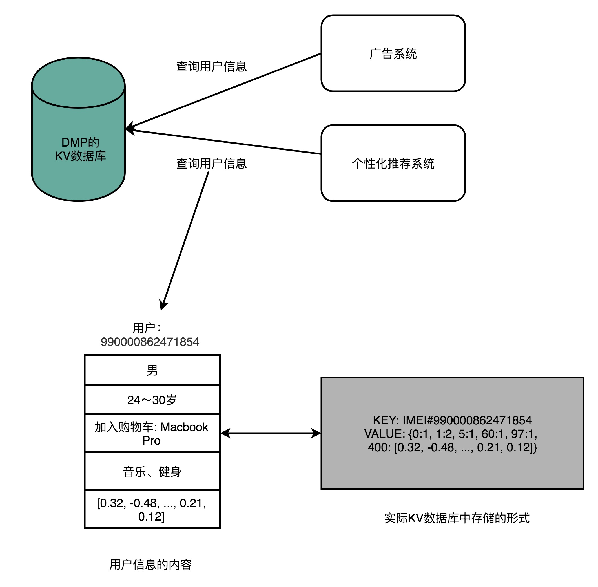
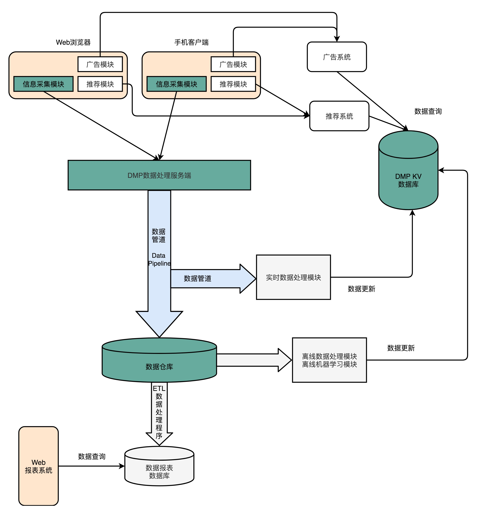
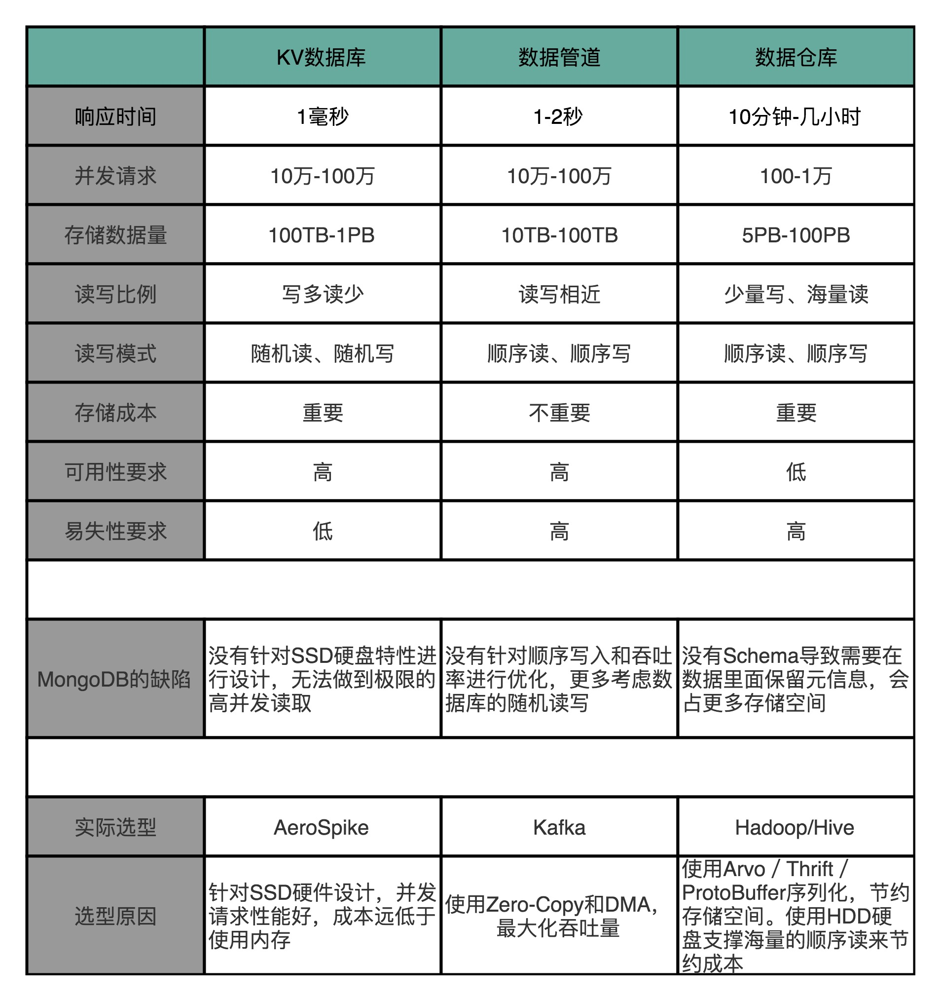

# 数据管理平台设计之存储器

## 前言

> 一般的应用或者网站都会自带广告模块和推荐模块，这是两个独立的模块，但是都需要同一个数据源，那就是用户的数据管理平台(DMP，Data Management Platform)。
>
> 而整个DMP系统的实现，会涉及大量的数据操作，包括但不限于日志分析，key-value数据库，数据管道，数据仓库。

**所以，本文会从存储的需求与技术栈的角度，来瞅一下如何更好的技术选秀，并且分析整个DMP系统中的整个数据采集过程。**

顺带带你回忆一下熟悉的广告信息和推荐栏的源头！

## 正文

>阅读本文必备知识：至少阅读[计算机存储器的层次结构简介](https://www.copydays.org/2020/05/21/173/)，[SSD硬盘的性能优化](https://www.copydays.org/2020/06/04/ssd硬盘的性能优化/)，[DMA技术和Kafka](https://www.copydays.org/2020/06/05/dma技术和kafka/)，知道基本的数据库类型，了解MongoDB，最好知道Cassandra，Hadoop，Hive。
>

### 一、数据管理平台（DMP）

数据管理平台，全称Data Management Platform，简称DMP。

其主要应用于互联网各类网站的广告定向（Ad targeting），个性化推荐（Recommendation）等领域。

简言之，DMP系统会通过处理大量的日志信息（用户的访问数据行为等），使用机器学习算法等，给每一个用户标注上各种各样的标签。然后进行定向的广告投放与个性化推荐，这也就是千人千面的来源！

使用的公司：Facebook，Google，LinkedIn，Wechat.......

### 二、DMP系统的特性

使用DMP系统的时候，将其简化为一个键值对（key-value）数据库，广告或推荐系统可以用一个用户的唯一标识，获得用户的各种信息。

这些信息一般包括：手机型号，最近一次的位置，个人注册时候的信息，最多次数的行为等。

对于DMP系统的特性，一般需要满足**五大点：低响应时间（Low Response Time），高可用（Hight Avaliable），高并发（Hight Concurrency），海量数据（Big Data），成本花费（Affordable Cost）。**

#### 1.低响应时间（Low Response Time）

低响应时间表示在获取用户数据的时候，相应时间必须短，广告和推荐信息必须随着用户点击之后的响应页面一同返回。

所以，这个时间一般都是ms级别。

#### 2.高可用（Hight Avaliable）

在分布式计算中讲过高可用，也就是运维的几个9.

所以，在DMP系统中，是必须保证机器永不宕机，不能出故障，必须一致工作。一旦停机，损失的就是money！

（注意：广告的收入全靠全年无休止的投放。如果区分白昼，那么做起全球业务的时候，就更不可以让机器闲着了，一般的跨洋访问延时是200ms。）

#### 3.高并发（Hight Concurrency）

由于每一次的广告投放是按照请求次数计算的，那么每一次请求都需要访问DMP系统，那么这个请求量就是非常可观的了！

但是，并不是说实现DMP系统的外部API需要自己实现并发，其实可以直接在整个通信层将所有的请求统一调度，进而分发。将具体的业务与实际的通信分开！

#### 4.海量数据（Big Data）

海量数据针对的是采集的样本数，其描述的也就是目前DMP系统中所有的key的个数，全世界也就几十亿人口，那么全部key也不会超过百亿的。

加上存储一个key，还需要保证包含一定的信息，并不是直接hash一个串串就行了，那么这个key的空间占用也是非常可观的。

#### 5.成本花费（Affordable Cost）

成本主要是广告业务的进账与自己整个系统的开支。

一般使用CPM（Cost Per mile）表示，也就是千次曝光数量，如果千次曝光的利润是1RMB，那么每一次的成本就不可以超过0.1分，想要净利润更高，那么就必须压缩自己的成本。

### 三、DMP系统数据加工

#### 1.数据来源

由于DMP系统，主要使用的用户的行为数据。

那么信息就只能从手机上的软件，浏览器等可以产生行为的地方来，感觉很复杂，其实很简单。就是别上网，一切都简单了！

一般，安装的应用或者请求的压面都内嵌了一个数据采集模块，通过采集用户的行为信息，向指定的服务器发送数据。

#### 2.数据管道（Data Pipeline）

由于只是从单个用户采集的数据，其实是杂乱无章，还不能表示任何动机。

此时就需要将数据放在数据管道，进行数据的临时存储。

注意：数据管道不是一个管道，其实还是将数据存储在了SSD或者HHD硬盘上。所有的数据搬运，是需要载体的，要么是内存，要么是硬盘。不是弄个管子，那管子要么是内存，要么就是硬盘！

#### 3.数据处理模块（Realtime Data Processing）

数据管道中的一部分数据，可以直接进行数据的处理，更新到DMP系统的键值对数据库。

如果是更新了性别，爱好，这种决策因子较大的数值，都会优先处理的。

#### 4.数据仓库（Data Warehouse）

数据仓库就是最常见的一堆存储器了，一般使用的是HHD硬盘，因为物美价廉！

虽然有的数据会进行数据的实时处理，但是基本上所有的数据还是会存储在数据仓库的，毕竟数据仓库才是整个系统最重要的存储核心层。

后期的数据报表，用户行为分析都是需要这个数据仓库！

### 四、DMP系统的技术方案之MongoDB

MongoDB一般作为web应用中的文件存储数据库使用。

**MongoDB与DMP结合还有一些优点：**

**1）不需要预先数据schema，随机访问速度很快，可以无限水平扩展；**

**2）随机访问的能力可以用作key-value数据库使用；**

**3）水平扩展能力，可以当做数据仓库使用；**

**4）只需要对MongoDB插入数据，就可以做到数据管道的作用。**

看似使用MongoDB可以解决整个DMP系统的所有数据操作，其实不然。

这里只是直觉觉得可以，其实并不是真的可以，已经属于职责不清的设计了。已经对于整个DMP系统进行职责的区分，只需要针对特殊的场景，选择性能最高的方案即可！

### 五、DMP系统的技术方案

只是单纯的使用MongoDB是不够的，必然会有性能的瓶颈。所以需要根据不同的应用场景进行相应的数据分配。

#### 1.key-value数据库之AeroSpike

由于键值对数据库的功能是：提供广告和推荐系统的查询，那么其一定要快！（低响应时间）

并且，还需要将这个数据库解耦，独立部署，内部的主数据需要存储在SSD硬盘中，保证数据在没有命中缓存的时候，可以快速的从硬盘中读取数据，对应的丈量指标就是IOPS。

从[AeroApike数据库](https://www.copydays.org/2020/06/04/ssd硬盘的性能优化/#六、AeroApike数据库)中可以知道，该数据库就是专门针对SSD硬盘设计的，那么性能可想而知，一定是非常好的！

并且使用开源的Cassandra也是一个不错的选择。

#### 2.数据管道之kafka

数据管道的主要作用就是存储大量的服务端下放的采集数据。并且支持数据处理模块和数据仓库的数据源支撑。

所以，需要支持高吞吐率，高并发，响应时间并没有极致的追求，并且数据的读写都是顺序，只是作为一个中间层的存储使用。

那么，针对数据管道设计的kafka必然就是最受欢迎的方案！

此时肯定是使用HHD硬盘比较合适，因为从[DMA技术和Kafka](https://www.copydays.org/2020/06/05/dma技术和kafka/)中，可以知道kafka其实可以使用DMA技术，保证零拷贝，最大化吞吐率！

如果使用SSD硬盘，不断地数据读写，对于SSD的寿命表示堪忧，毕竟SSD是按照块擦除数据的，哪怕是顺序的读写，数据量在那里放着，寿命也在那里摆着。

#### 3.数据仓库之Hadoop/Hive

数据仓库主要是进行后期的数据分析处理，数据存储是一个大问题。

这个仓库就是一个真正的大号仓库，所有的数据都是需要存储的，成本的可控，必然导致选择HHD硬盘。

由于可观的数据量，存储的数据必然已经是TB，PT级别了。

并且这些数据还不只是临时存储，是固化的存储，一般不随便删除，这也就是大家熟知的样本，一旦池子大了，样本就会急速膨胀。

在数据仓库中，需要定义好明确的achema，每一个字段都不需要存储额外的元数据，通过Avro、Thrift、ProtoBuffer这样的二进制序列化的方式存储下来！

也可以直接使用Hive这样明确字段定义的数据库存储。

## 结束语

关于数据管理平台的存储方式，基本上就是这么多了，但是对于整个DMP系统，其实还是有很多值得探讨的点。

只是针对某一个场景的技术选型，其实都是差不多的，一般适可而止还是追求卓越的性能，需要权衡。（这就像战争，总有人是爱好和平的，但是总有人会喜欢打仗的！）

**不管是AeroSpike还是kafka，又或者是Hadoop集群，其实都只是操作数据，所有的技术手段都是为了完成某些功能，不局限也就明确了！**

