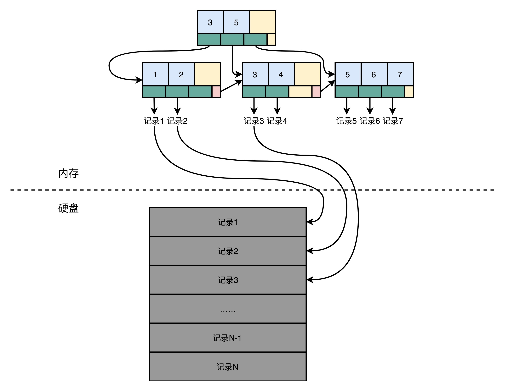
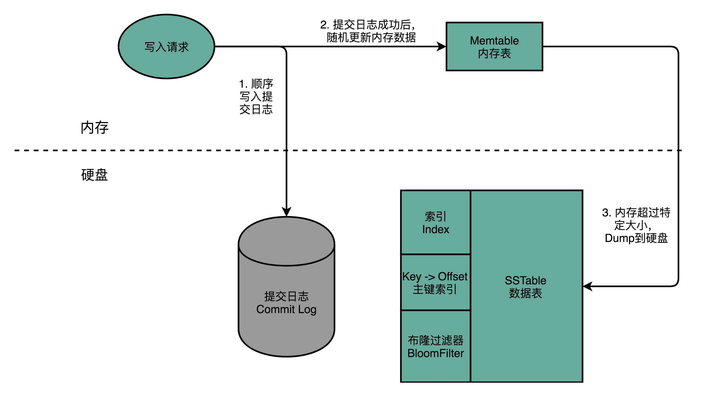
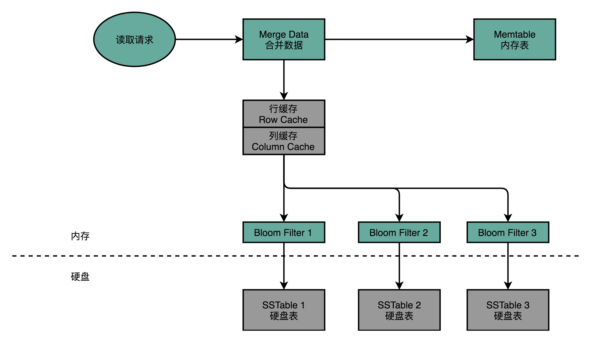
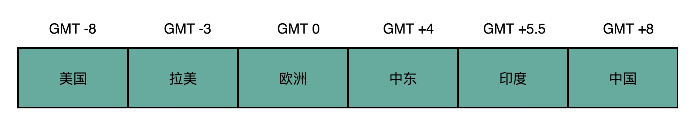

# 数据库实现之Cassandra

## 前言

> 关于数据的存储，有很多方案。
>
> 有内存的键值存储数据库，有数据管道的kafka，有分布式存储的Hive等等。
>
> 不管名字是什么，其实对于数据的操作，都可以抽象为两件事：读和写。
>
> 所以，不同的数据库，只是不同使用场景的产物，既然能够被提出来，必然是经历过测试实验的，实用性还是具有一定基础。

所以，在数据的选择，重点是**使用场景和性能。还有成本~**

## 正文

>阅读本文需要具备：有数据库使用经验，知道常见的关系型数据库。
>

### 一、关系型数据库实现原理

一般的数据库，描述的其实是**数据库管理软件**。

**数据库管理软件内部会有多个自建的数据库，内部再建立数据表，表中存储每一行的数据。**

#### 1.索引

一般的数据库操作，需要先连接数据库，使用SQL语句进行数据表中数据的读取。当忽略数据库的操作，只是单纯的查一个数据，是需要手动去遍历整张数据表，最终得到一个满意的结果。

只是随机遍历，效率太低，吞吐率上不去，那么一般的数据库都会存在一个索引，也就是常说的id，或者主键。只是这个索引被数据库内部重新进行了每一行数据的索引，如**B+树**这种实现方式，将所有的主键聚集在一起，保证可以快速查找满足条件的数据。

上述的索引，只是一个映射关系，保证直接从硬盘读取的位置就是这个行号对应的那一条数据。并且索引一般都是直接加载在内存中，提升查找性能。

#### 2.读写数据

由于存在索引，并且索引还可以不是主键，将其他字段设置为索引之后，在写入数据的时候，需要同步更新多个索引表。（索引表只是形象的名称表示，并不是表）

所以，此时虽然是更新一条数据，但是需要同步更新多个数据。

对应的在查询的时候，也可以使用除了主键的条件，性能算是提升了。

#### 3.随机读写

由于数据的操作，并不是顺序的，那么一旦随机，整个索引的查找速度就会是一个直接的影响因素。

关系型数据库中，并适合大量的数据随机读写。

尤其是在[数据管理平台设计之存储器](https://www.copydays.org/2020/06/09/数据管理平台设计之存储器/)介绍的DMP系统中的key-value存储。

### 二、Cassandra

#### 1.简介

**Cassandra是Facebook，2008年开源的分布式键值存储数据库。**

支持大量数据的随机读写。

#### 2.数据模型

一般**将Cassandra的键称为Row Key，是一个16-36字节的字符串。**

将每一个Row Key对应的值表示为一个哈希表，内部使用键值对存储需要的数据。

Cassandra没有严格的schema，数据库创建好之后就定义了有哪些**列（Column）**。

Cassandra内部有一个**列族（Colume Family）**的概念，将经常使用的字段，放在同一个族里面。这里的基本思想是空间局部性原理。

#### 3.写操作

Cassandra对于随机写的解决方案：不随机写，只顺序写。

**一般的写操作分为两步：**

**1）将数据向磁盘上写入一条提交日志（Commit Log），这个日志类似于MySQL内部的日志。**

**2）第一步操作成功之后，进行内存中数据的更新。**

**3）内存数据达到一定大小之后，存储（dump）到硬盘中。**

**4）后台文件的对比合并（Compaction）。**

其实，最关键的是这个提交日志，这个提交是顺序写入的，而不是随机写，那么对应的硬盘操作也就会更快。（硬盘的顺序写一定是快于随机写的）

还有一个比较重要的就是，内存数据dump到硬盘的时候，也是顺序写入到硬盘。Cassandra会根据Row key生成一个索引文件，方便后续基于索引来进行快速查询。

数据的对比与合并，Cassandra也是进行顺序操作的。顺序读取多个文件，在内存中合并完成，重新dump一个新的文件。

#### 4.读操作

**读取数据的时候，会先从内存中读取数据，再从硬盘中读数据，然后将数据合并称为最终结果。**

**一般分为以下几步：**

**1）发送一个读数据请求**

**2）内存中找数据并读取**

**3）内存中找硬盘在内存中的缓存读取数据**

**4）缓存没有命中之后，会去硬盘中按照时间从最新的往旧的里面找**

注意：由于去硬盘中找数据会找多个文件，那么Cassandra做了一个优化，在写入数据的时候，为每一个dump文件生成一个BloomFilter，并且将BloomFilter放在内存中。所以，在读硬盘的时候，会先进行BloomFilter过滤，并且这个过滤避免了多余的硬盘数据请求，还直接就可以一次命中数据。

### 三、DMP系统的时区优化

在DMP系统中说过时区的影响。

但是真正如何去做呢？

其实很简单，由于地球一圈是24小时，但是网速绕地球一圈的时间大约是光速走过的时间。

可以近似的认为并不是无时无刻地球上的people，都在上网，就不说那些还没有手机的了，就算有手机也不是一天24小时都上网。

那么此时针对整个DMP系统，其实就没有必要存储这个时间段大概率不上网的人的信息。

对应的就是，DMP系统中键值存储数据库，在内存中只需要加载当前时区是高峰上网的人群的信息即可。其他的人就算上网，也只是少数，可以使用访问硬盘完成数据请求。

基于时区的方式降低内存中数据的存储量，是一个时间局部性的应用，但是这也仅限于全球的产品。

如果将数据命中硬盘，那么SSD才是首选，HHD是不堪入目的！

## 结束语

关于Cassandra的内容，还是需要自己前身操作，看那官网的介绍。

还是需要动手实践的，只是这种数据库的应用场景限制，必然不会像MySQL那么常见，其实完全是可以做到随用随学的。

阅读愉快！

## 参考链接

1.Cassandra - A Decentralized Structured Storage System：https://research.cs.cornell.edu/ladis2009/papers/lakshman-ladis2009.pdf

