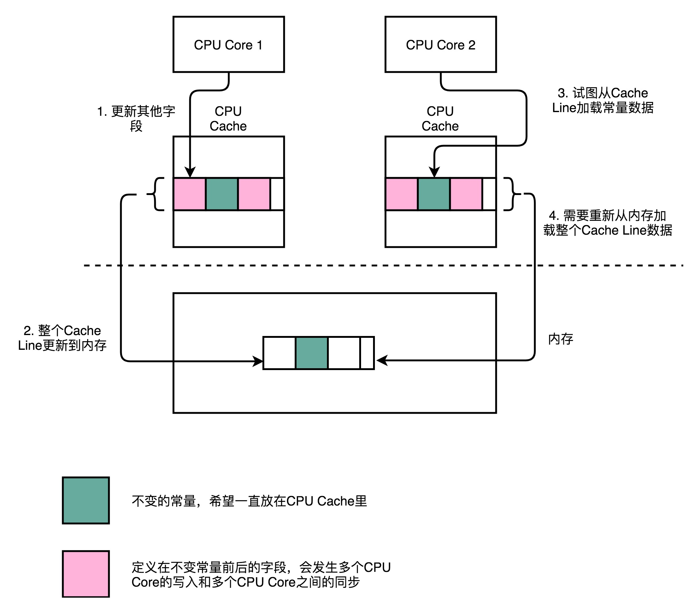
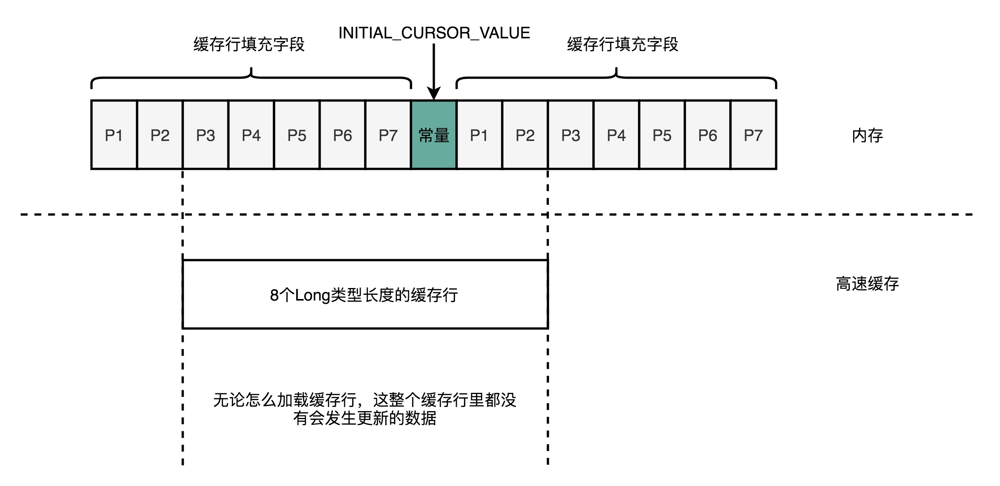
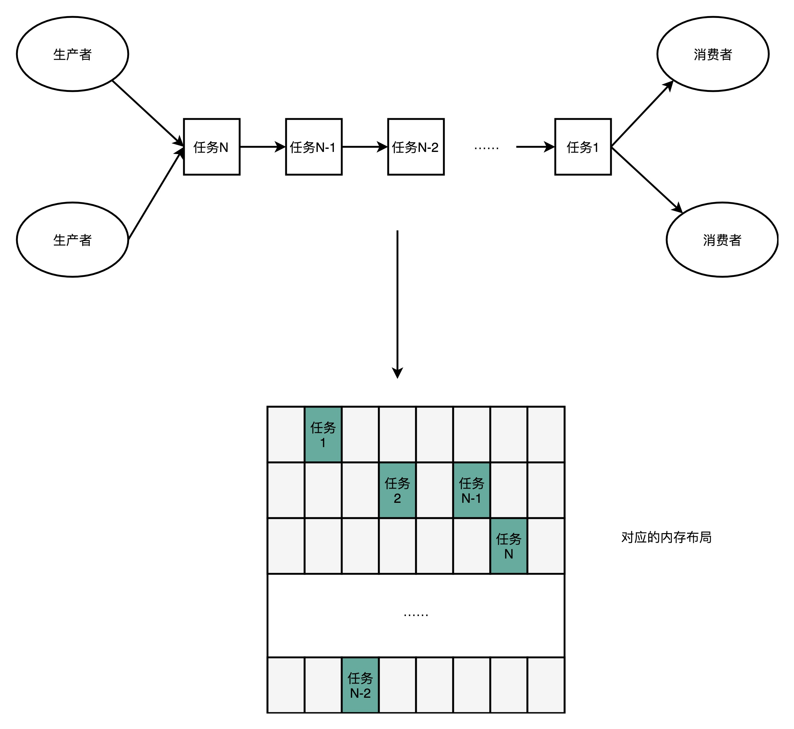
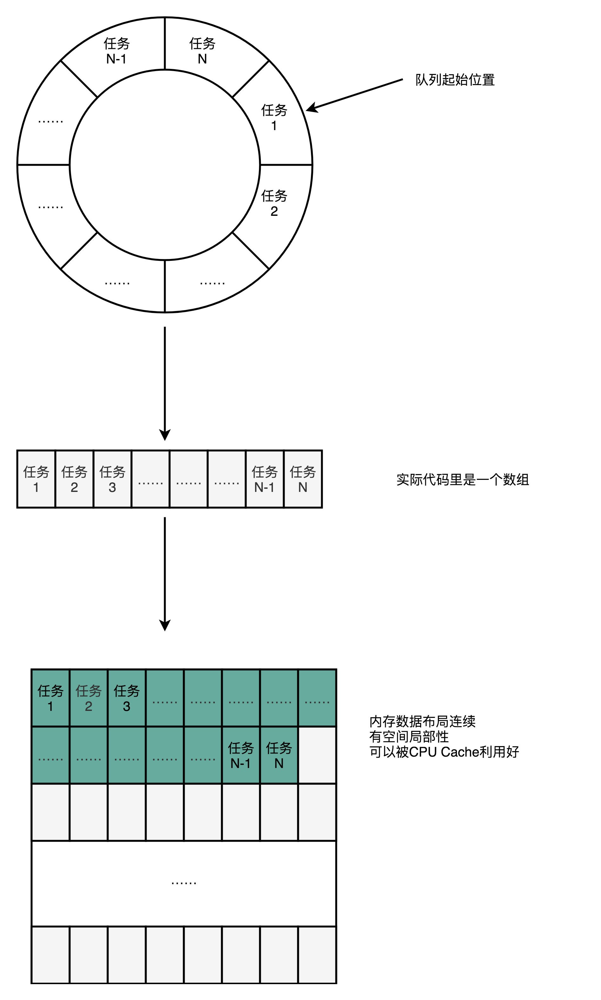

# Disruptor之高速缓存行设计

## 前言

> 在学习CPU的高速缓存之后，需要更加了解其在业界的使用，如Disruptor这个开源的生产者消费者队列。
>
> 看看什么是缓存行填充技术，为什么使用这个技术之后，性能就可以提升。

本文会聚焦在Disruptor的高速缓存设计，并且一起来看看源码！接下来的两篇文章会分别介绍Disruptor如何实现无锁化和具体的代码演示。

PS：最近由于自己的粗心，丢失了一些数据，带来了一个对于数据持久化的思考。（当然是有价值的数据）


## 正文

>阅读本文的基础知识：阅读[CPU Cache之数据写回](https://www.copydays.org/2020/05/24/cpu-cache之数据写回/)，[CPU Cache之数据读取](https://www.copydays.org/2020/05/23/cpu-cache之数据读取/)，知道CPU缓存的一些内容。
>
>了解性能与基础数据结构，知道时间与空间局部性原理。

### 一、简介Disruptor

Disruptor是一个高频公司LMAX开源的项目，可以直接github上找到。

Disruptor利用的事CPU内部的高速缓存，但是不是使用C or C++ 实现的，而是使用java语言实现，最终的性能也并没有被JVM虚拟机限制。


### 二、缓存行填充（Padding Cache  Line）

#### 1）缓存回顾

关于缓存应该是不陌生的，如果还感觉陌生，只能说明自己思考太少！

由于各种硬件的性能差异，所以缓存就出现了，作为速度的缓冲层，对于计算机而言，缓存和对应的价格与性能，如下表。

所以，想要速度快，就需要高效实用缓存，但是使用内存的效果肯定是没有使用CPU内部的高速缓存好的。具体差异查下表。


#### 2）CPU缓存行

**在64位CPU中，缓存行一般都是64个字节（Bytes）.**

在java语言中，一个long类型的数据占用8个字节，那么对于CPU而言，每一次加载的数据就是8个long类型的数据。

如果上面加载的数据是一个**数组，那就提高了缓存的命中率**，所以这也是**双for循环，不同次数互换加法，花费的时间不相等的原因。**因为命中率不同。

如果上面的数据不是数组，而是一些变量，那么当这些数据加载到不同的CPU内核之后，就会出现问题了。

CPU每一次的缓存行加载，都包含多个变量，由于变量的操作很随机，一旦某个CPU核心进行数据的更改之后，就必须强制将数据写回到内存中，其他CPU核心的数据也会直接失效，那么变量的操作一旦频繁，就会出现数据访问变慢，性能自然就差了！




#### 3）Disruptor登场

**Disruptor解决的就是变量在缓存行中频繁失效重载的问题。**

**由于缓存行一次加载的是64字节的数据，那么就让CPU加载的时候，随便怎么加载，在着64个字节的数据中，只有一个变量，那么只是针对这个变量的操作就不会影响其他的变量了。**

示意图如下：




#### 4）Disruptor代码

**这里主要献上Disruptor缓存行填充的代码。**

Disruptor需要在数据的前后分别填充7个字节的lang类型数据，并且INITIAL_CURSOR_VALUE 是一个常量。前7个填充数据来自RingBufferPad，后7个来自RingBuffer。

具体的实现源码如下：

```java
......
 
 
abstract class RingBufferPad
{
    protected long p1, p2, p3, p4, p5, p6, p7;
}
	
abstract class RingBufferFields<E> extends RingBufferPad
{
    ......
}
 
 /**
 * Ring based store of reusable entries containing the data representing
 * an event being exchanged between event producer and {@link EventProcessor}s.
 *
 * @param <E> implementation storing the data for sharing during exchange or parallel coordination of an event.
 */
public final class RingBuffer<E> extends RingBufferFields<E> implements Cursored, EventSequencer<E>, EventSink<E>
{
    public static final long INITIAL_CURSOR_VALUE = Sequence.INITIAL_VALUE;
    protected long p1, p2, p3, p4, p5, p6, p7;
    ......
```


#### 5）空间换时间

从上面代码中，可以很明显的到使用空间来换取更快的时间！多了14个没有实际意义的数据，但是变快了，充分利用了CPU的高速缓存。

所以，对于性能的提升，更多都落在了时间与空间的局部性上。


### 三、RingBuffer

#### 1）生产者-消费者模型（Producer-Consumer）

关于生产者和消费者这种模型，其实非常的实用，很多的任务都是基于这种方式实现。

在Disruptor中，更是这种模型的典型实现。

注意：只要是进行任务调度的方式，都可以抽象为生产者和消费者，仔细想想其实还真是！




#### 2）链表实现队列

一般的生产者-消费者模型中的任务队列都是使用链表实现的，尤其是在编程语言层面，已经提供的队列这种库，直接调用即可，如：LinkedBlockingQueue。

对于队列的操作，只需要关注生产者的入队，消费者的出队即可。

链表内部的各个节点的数据，不会出现在连续的内存空间中，多以使用不到CPU的缓存行，也就对应的性能略差。


#### 3）数组实现队列

Disruptor中使用的是数组形式的队列，其内部使用的一种叫做RingBuffer的数据结构，作为一个固定长度的数组。

由于使用的是数组，那么就可以很好地使用CPU的缓存行机制，也就是对应的空间局部性。

由于更多的缓存命中，CPU数据处理的时候，对应的多级流水线也会更好的适配。

RingBuffer的大小是自己在使用Disruptor自己指定的，一般是2的n次方，如1024。




#### 4）RingBuffer大小源码

RingBuffer的大小最终创建成数组，对应的源码如下：

```java
/**
 * Construct a Sequencer with the selected wait strategy and buffer size.
 *
 * @param bufferSize   the size of the buffer that this will sequence over.
 * @param waitStrategy for those waiting on sequences.
 */
public MultiProducerSequencer(int bufferSize, final WaitStrategy waitStrategy)
{
    super(bufferSize, waitStrategy);
    availableBuffer = new int[bufferSize];  // 常见的数组
    indexMask = bufferSize - 1;
    indexShift = Util.log2(bufferSize);
    initialiseAvailableBuffer();
}
```


## 结束语

关于Disruptor如何使用CPU的高速缓存行的内容就差不多了，但是只有理论还不够，所以还需要实践。

推荐，自己创建的project，自己试试！

**后续还会有具体的Disruptor实践的内容，敬请期待！**


## 参考链接

1.Disruptor：https://github.com/LMAX-Exchange/disruptor/wiki/Introduction

