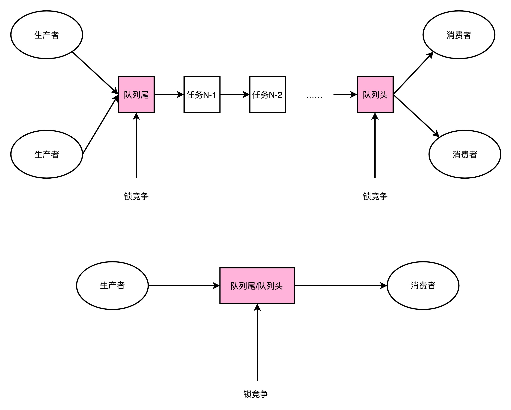
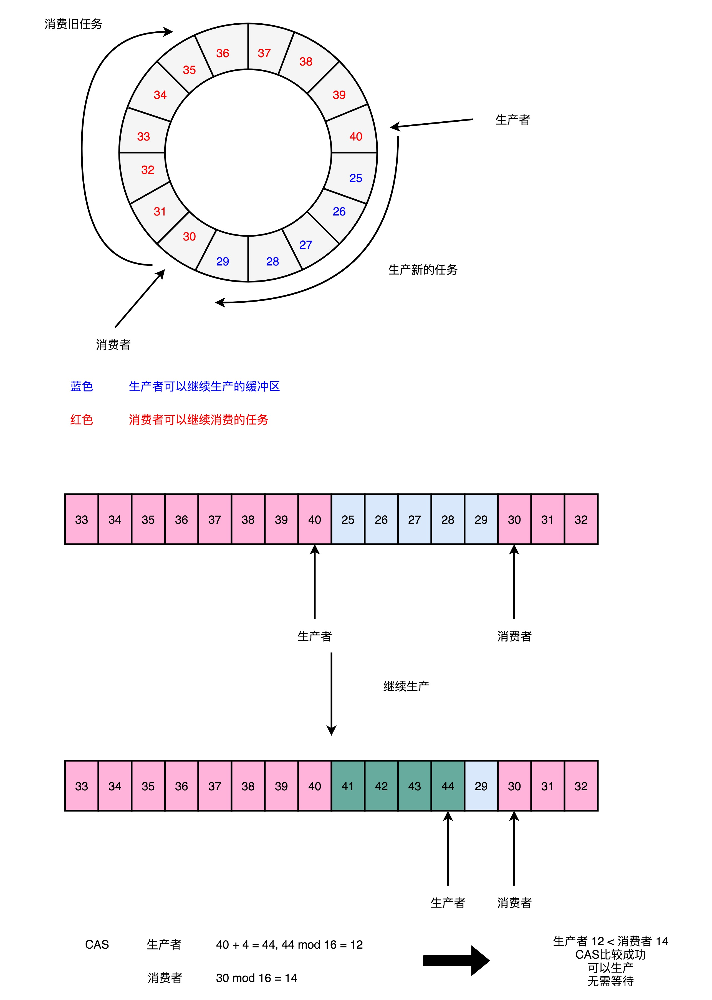

# Disruptor之无锁实现

## 前言

> 本文是Disruptor的第二篇文章，推荐先看第一篇：[Disruptor之高速缓存行设计](https://www.copydays.org/2020/06/11/disruptor之高速缓存行设计/)，理解高速缓存这个硬件结构带来的性能提升。
>
> 在应用程序中，凡是存在数据竞争，就必然需要保证数据的安全性，那么加锁就变成了一种常见的解决手段，而加锁本质是：直接锁对象或者方法或者数据。
>
> 其实，还可以将加锁的形式变化一下，由于CPU天然就是做计算的，那么对于数值的比较也必然是最快的，对应就有一种CAS的CPU级别的原子操作，可以将数据变为另一种数字的形式比较，只需要进行比较判断，最终就可以完成复杂的加锁。

本质上，加锁或者CPU的原子操作，最终为了完成功能，都是需要执行CPU的机器码，对应的机器码总数减少了，速度必然快！（忽略每一条的指令对应的CPU cycle不同情况）


本文会聚焦在Disruptor的高速缓存设计，并且一起来看看源码！接下来的两篇文章会分别介绍Disruptor如何实现无锁化和具体的代码演示。

PS：最近由于自己的粗心，丢失了一些数据，带来了一个对于数据持久化的思考。（当然是有价值的数据）

## 正文

>阅读本文的必备基础知识：知道CPU的基础知识，需要深入到指令级别，寄存器操作，知道生产者和消费者模型，能看懂程序。
>

### 一、队列

在Disruptor的实现中，使用RingBuffer这种无锁的队列，对比java基础库中LinedBlockingQueue的详细分析如下

#### 1）RingBuffer

速度：快；

数据结构形式：数组；

是否加锁：否；


#### 2）LinkedBlockingQueue

速度：慢；

数据结构形式：链表；

是否加锁：是；

锁实现：对应于操作系统加锁机制（OS-based Lock），需要操作系统内核裁决，所以一般会发生上下文切换（Context Switch），将没有获取锁的线程挂起等待；（上下文切换，就是将寄存器等数据，全部放在线程栈中，已经在高速缓存和数据和指令，都需要被退回到内存中。）


### 二、生产者和消费者队列

**在使用生产者和消费者模型的时候，由于有多个生产者和消费者，那么必然会存在对于数据的锁竞争。（针对大众场景）**

所以上述的锁竞争可以分为两种：

**1.多个生产者竞争写入数据；**

**2.多个生产者竞争读出数据；**

这里需要注意：生产者在写入数据的时候，也需要获得消费者的锁；同理，消费者在读出数据的时候，也需要获得生产者的锁。

**一般情况下，需要生产者小于等于消费者，不能让任务在队列中堆积，所以基本上每一次的数据操作都是需要竞争锁，对应的性能，必然不好！**




### 三、无锁与加锁示例

对比加锁和无锁的代码实现，带来的性能差异，也就是运算的时间差异。

```java
import java.util.concurrent.locks.Lock;
import java.util.concurrent.locks.ReentrantLock;


public class LockBenchmark {

    public static void runIncrement() {
        long counter = 0;
        long max = 500000000L;
        long start = System.currentTimeMillis();
        while (counter < max) {
            counter++;
        }
        long end = System.currentTimeMillis();
        System.out.println("Time spent is " + (end - start) + "ms without lock");
    }


    public static void runIncrementWithLock() {
        Lock lock = new ReentrantLock();
        long counter = 0;
        long max = 500000000L;
        long start = System.currentTimeMillis();
        while (counter < max) {
            if (lock.tryLock()) {
                counter++;
                lock.unlock();
            }
        }
        long end = System.currentTimeMillis();
        System.out.println("Time spent is " + (end - start) + "ms with lock");
    }


    public static void main(String[] args) {
        runIncrement();
        runIncrementWithLock();
    }
}

/*
Result:
Time spent is 137ms without lock
Time spent is 7752ms with lock
*/

```


### 四、无锁源码之cmpxchg

在Disruptor中，利用了CPU硬件支持的指令，叫做CAS（Compare And Swap），对应于CPU的指令是cmpxchg。




#### 1）当前Sequence序号值

在Disruptor的包中，使用RingBuffer创建了 一个Sequence对象，用来指向当前的RingBuffer的头和尾，使用的是一个序号的方式，见下面表示：

```java
class LhsPadding
{
    protected long p1, p2, p3, p4, p5, p6, p7; // 左填充
}

class Value extends LhsPadding
{
    protected volatile long value;  // 当前的值
}

class RhsPadding extends Value
{
    protected long p9, p10, p11, p12, p13, p14, p15;  // 右填充
}

public class Sequence extends RhsPadding
{
    /**
     * Perform a volatile read of this sequence's value.
     *
     * @return The current value of the sequence.
     */
    public long get()
    {
        return value;
    }
}
```


#### 2）compareAndSet方法

当需要添加数据的时候，将需要添加的数值传入addAndGet方法，计算添加后的最新序号，并使用while，进行忙等到一直到数据比较成功，返回最新的序号值。

此时一旦返回，则代表着整个数据的添加的操作，可以执行。源码见下面：

```java
    /**
     * Perform a compare and set operation on the sequence.
     *
     * @param expectedValue The expected current value.
     * @param newValue The value to update to.
     * @return true if the operation succeeds, false otherwise.
     */
    public boolean compareAndSet(final long expectedValue, final long newValue)
    {
        return UNSAFE.compareAndSwapLong(this, VALUE_OFFSET, expectedValue, newValue);
    }


    /**
     * Atomically add the supplied value.
     *
     * @param increment The value to add to the sequence.
     * @return The value after the increment.
     */
    public long addAndGet(final long increment)
    {
        long currentValue;
        long newValue;

        do
        {
            currentValue = get();
            newValue = currentValue + increment;
        }
        while (!compareAndSet(currentValue, newValue));  // 忙等待

        return newValue;
    }
```


#### 3）UNSAFE.compareAndSwapLong

在实际的忙等待调用中，调用的是本地的native方法，直接是CPU硬件支持的机器指令，见下面所示：

```java
public final native boolean compareAndSwapLong(Object var1, long var2, long var4, long var6);
```


#### 4）cmpxchg

cmpxchg是真正调用的CPU指令，由三个操作数组成，

**第一个操作数不在指令里面出现，是一个隐式的操作数，是EAX累加寄存器里面的值；**

**第二个操作数是源操作数地址，cmpxchg指令，会对比这个操作数和累机器寄存器的值；**

**第三个操作数是目标操作数地址，如果对比相同，CPU会将ZF（条件码寄存器里面的零标志位的值）设置为1，并将目标操作数，设置为源操作数的低智商；如果对比不相等，就回把源操作里面的值，设置为累机器寄存器里面。**

所以，一旦使用这个指令，就不需要给数据加锁，天然就是原子操作。

```sh
cmpxchg [ax](隐式操作数， EAX累加器), [bx](源操作数地址), [cx](目标操作数地址)
```


### 五、应用cmpxchg示例

当然不是直接写汇编代码，操作CPU，而是使用java语言内部的AtomicLong。

由于AtomicLong内部incrementAndGet()方法也是基于compareAndSwapLong()方法，所以其也是一个cmpxchg实现的示例。

```java
import java.util.concurrent.atomic.AtomicLong;


public class NewLockBenchmark {

    public static void runIncrementAtomic() {
        AtomicLong counter = new AtomicLong(0);
        long max = 500000000L;
        long start = System.currentTimeMillis();
        while (counter.incrementAndGet() < max) {  // incrementAndGet内部实现cmpxchg
        }
        long end = System.currentTimeMillis();
        System.out.println("Time spent is " + (end - start) + "ms with cas");
    }

    public static void main(String[] args) {
        runIncrementAtomic();
    }
}
```


## 结束语

本文基于Disruptor的无锁实现展开，看了生产者和消费者模型，探讨了队列的锁实现。

看了看Disruptor内部是如何实现无锁操作的，虽然采用的是CAS的忙等待方式，但是性能的提升非常理想。

并且结合应用程序可以更快的理解为什么要使用CPU指令cmpxchg的实现方式。

阅读愉快！


## 参考链接

1.Disruptor：https://github.com/LMAX-Exchange/disruptor/wiki/Introduction

2.Implementing Lock-Free Queues：http://citeseerx.ist.psu.edu/viewdoc/download?doi=10.1.1.53.8674&rep=rep1&type=pdf

