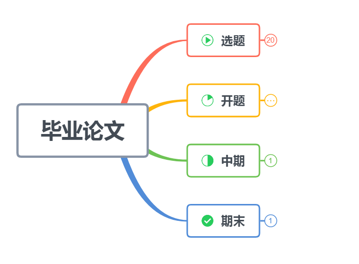

# 毕业篇|概览（本科or硕士）毕业设计

## 前言

毕业篇这个系列的文章，包含完成**（本科or硕士）毕业论文的方法论**和**本人实践（学生角度）的总结**。

初步计划更新周期是 **2019.9 - 2021.7**。真个系列按照阶段大致分为选题，开题，中期，期末。

各阶段，文章内容分为**两种**，一种是方法论，另一种是亲身实践总结。

希望自己可以在硕士毕业的时候，完成这一系列自我交付的内容。

## 正文

### 背景介绍

在很久之前，我就在计划书写关于毕业设计的内容，初衷很单纯，为了自己可以更加高效的完成自己的毕业论文。

所以，这个初衷必然追踪到了，开始研究生的那一天，也就是**入学的那一天**。可以说，在报道的第一天，都在计划怎么毕业，感觉有一点不可思议。确实不可思议，毕竟身边的各位好像完全不关心毕业，还沉浸在可以上学的喜悦中。好吧！当我前面这句话是废话：）

**在初衷的坚持下**，我看了很多内容，了解了很多关于毕业设计的方法论。但是，我突然发现，这些都不重要，重要的还是**自己的坚持与努力**。实力到了，毕业不是问题，什么都不是问题。

综上所述，我希望看到这篇文章的人，可以明白一句话：**毕业论文没有捷径，需要自己一点一点的打磨。**

但是，我希望我的这一系列文章，可以帮你看到**不同的人**是怎么看待毕业设计，怎么解决问题的，不同的思考角度，以及如果是你，你又会怎么做？

好了，开篇废话有点多，开始正题了~

### 方法论

#### 方法一：本科与硕士都是怎么看待毕业设计的？

本科生角度：第一次做毕业设计，不懂，不敢问，其实是不知道问谁，也不知道问什么。
真实的写照是，本科的导师，在选题的时候见一面，开题见一面，中期估计见不到，期末的时候，会见一面。估计会说声：毕业再见！ or 你这不行啊！需要改！！！
大部分的本科毕业生是懵懂的，毕业设计题目拿到之后，要么开始思考，之后不会，就放下来，等到开题的时候，慌了~还有一种是少见的，找人问，找学姐问，但是呢，学姐好像也不会，最终还是靠自己，然后很努力的查资料，各种碰壁，最终到了开题，这个时候，至少可以拿出自己的见解了，不是很慌~
以上就是我经历的以及看到的，最严重的是到了毕业最终答辩的时候，都讲不清楚自己做了什么……(真有这样的人)

硕士生角度：算是第二次做毕业设计了，不管本科的时候是不是混了，至少这个流程是走完了，不然那也混不到硕士，本科都毕不了业。
自己有上一次的经验，在每一次与导师的交流中，也都会显得从容一些，至少知道怎么说话了。但是，一般学校的研究生毕业会有一个中文核心的小论文要求，然后这是一个头疼的事，如果你不把这个事搞定，那么你连毕业最终答辩的资格都没有，没有资格比自己菜更显得尴尬。

总结，以上就是我对于自己看到的本科生与硕士生，进行的总结。勿对号入座哦~

#### 方法二：你真的清楚毕业流程吗？

现在我们谈一下毕业的流程，每一个学校都是不一样的，但是都不可能简化到：时间到，发毕业证，然后走人……

相比较，本科的毕业流程会简单一下，会从xxx年1月开始 到 xxx年7月，总共耗时半年，别忘记了中间还有2月的那个寒假，时间就更短了，5个月的时间而已。从选题到最终的毕业答辩，可以在各自学校的官网中的本科管理中找到毕业论文的要求与准则，一般100+页，大多是繁琐的条款，你需要研读一下。由于学校一般会有学院和系，还有专业的划分，所以具体的要求可能会调整，尤其是表格样式与时间。
但是，论文正文内容，还是需要自己多用心思。

研究生的毕业流程，首先时间会长于本科，笼统的说跨越了两年的时间，两年啊！一般学校的研一都是上课，修课程学分。研二，不上课，需要准备将到来的开题，一般是10-12月，最迟下一年的元月。中期，会在研二的第二学期的学期末，一般是5-7月。末期答辩，一般都是研三的第二学期的，时间是4-5月。关于毕业的流程，完全是等学院通知了，研究生的各项事项基本都是学院处理完，直接上报学校即可。

以上的时间节点，是我参考自己上中下三阶得到的，同样也是我的自己需要注意的。

#### 方法三：你需要怎么‘玩’这个毕业设计？

解释一下：这里的玩，不是让你混毕业。是想让你轻松的搞定毕业设计，不用那么煎熬啦：）

这里有一些自己做的事与思考的内容：

> 1.总结一下你现在的生活作息，真的好吗？如果不好，那就调整，调到自己满意的生活作息，也别太快（慢慢来），毕竟上学上的大家晚上不睡，早上不起，这样子可不好！（希望，这个习惯可以在玩毕业设计的时候养成，并且保持下去）
>
> 2.学习好的做事，做人方法，提高自己的思维。好，这个字不好定义，但是让自己看的下去，效率需要提高，效率的评判有一个没争议的角度，即时间角度。使用时间来 审视自己，思维太抽象，只能自己悟了。
>
> 3.思考一下诗和远方吧！还有思考工作！也许你的工作找到了，也许没有，但是工作是必须要思考的，尤其是30岁之前，唯一与时代匹配的就是工作的用人标准。诗和远方，那可是自己的梦想，绝对不容许任何人，轻蔑自己的梦想，这是你我坚守的最后一寸净土。
>
> 4.制定一个计划。计划不仅仅是玩了毕业设计，还有毕业之后的n年，多计划计划现在与下一个人生的阶段，整个人的思维都不一般了。毕竟，人是向前看的，只是迟早的事。
>
> 5.执行力。你的生活作息，你的做事，你的思考，你的计划，都是执行力下的产物。在我本科毕业的这400天内，我深刻的意识到了执行力的重要性。切记，执行力可以做到自己都不到的事。

### 总结

短短的2000字，我将整个两大毕业设计从时间的维度上串联起来。不是想勾起你的焦虑，只是想让你更加的清楚下一步等你的是什么。

针对本科与研究生的这两个角度看毕业设计，深层次反应的是时间逝去带来人的成长。

在毕业流程中，使用时间串联起来每一步的时间点，算是做到了以始为终，还没有开始就看到了结束的样子，剩下的就是你去填空空了，每一个阶段都会有不一样的收获。

毕业设计，不是拿来玩的，而是拿来“玩”的，不然浪费了自己的时间。如果等你说出：‘早知道，我就好好做毕业设计了！’ 这句话的时候，那我的这一系列文章，算是没有起到作用。

## 结束语

正如我在前言所述的，这一系列文章只是，我对自己的经历与感悟进行的总结。但是，我也希望这些内容，可以作为你的指路灯。毕竟，只有在前人的经验中，你才可以走的更快，并且更加坚定。

下一篇，我将从开题这个角度切入，敬请期待。

PS：这篇文章其实已经迟到了，原本是中秋节要产出的，然后拖了2天，看来我的执行力也需要审视一下了。哈哈！此文，写于 己亥年【猪年】八月十九（2019.9.17）。

