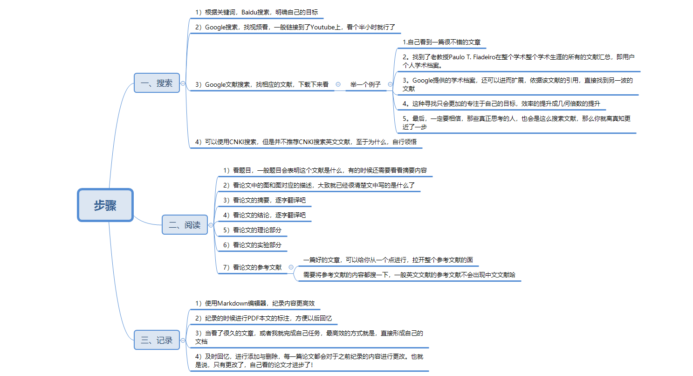

# 如何快速阅读英文文献

## 前言

> 关于阅读文献，我觉得是没有毕业之前，每一天都需要做的事！
>
> 你可以前期阅读中文文献了解一些基础的知识，但是当真正开始阅读英文文献的时候，就要全部忘记掉中文文献说的那些东西，至于为什么，请见正文。

**书山有路勤为径，学海无涯苦作舟！**

附上本文的框图，正文只会基于这个基础进行展开，但更多的是临场发挥。

## 正文

> 关于本科毕业，研究生毕业的论文研究，其实是有**捷径**的，但是阅读文献的数量是不能少的。
>
> 就自身熟知的语言中，貌似也就只有中文和英文了，怎么选择，自己心里还是需要一些**考量**的。

### 一、谈心态

> 这是我临时添加的内容，在框图中并没有包含，也算是放飞自我了！

**一句古话：剩者为王！**

是的，就是需要熬，好好的熬着，本科生熬半年，研究生熬两年。

**想要最后的胜利，就是要熬死隔壁宿舍，哈哈！**

纯属玩笑了，在毕业设计的旅程中，有很大块的时间去做一些事，但是这些时间自己再过去肯定是没有经历过的，所以如何安排呢？

----

**就问你：如何高效的过好每一天呢？还不是很累的过着每一天呢？等等问题。**

由于是第一次，如果自己还不懂得整个学术的环境，还不知道那些套路，再加上自己还比较烦躁，那么你就需要心态了。

----

我从**理论研究和实践研究的角度**带你看看你的毕业论文属于哪一类，以及你需要走的路，和你需要具备的心态，

在理论研究和实践研究中，理论研究一定是优胜于实践研究的，但是为什么现实的结果是理论败于实践呢？

原因是实践研究一上来就是各种操作，理论则需要从整个体系出发，大部分人只是做到了前者的理论，却不知道理论真正才是王者，那可就是不出手还好，一出手就是干翻实践研究。

理论的最终才是实践，实践就是理论的最终升华，很多人都看不到这一点。（包括我自己，眼界真的是个问题啊！）

所以，实践研究与理论研究需要具备什么样子的心态，我想你我都是很清楚了。

### 二、谈搜索

还是前言的那句话，一开始阅读中文的时候，可以使用百度文库，CNKI进行检索。

但是，**一旦开始觉得自己掌握的差不多，是时候来一个更深层次的提升的时候，那就需要英文文献了。**

注意：虽然CNKI也是提供英文文献检索的，但是你记住CNKI也只是CNKI而已，还有你更值得使用的工具。（如果你不想浪费时间的话！其实CNKI也是不错的！）

----

关于搜索，有多少人一开始想到的就是百度了？谈文献就是CNKI吗？

那你，**值得使用Google scholar！**

都知道YouTube，还知道Facebook，还知道Google，那么Google scholar也离你不远了。

-----

**两点建议：**

**1.本科生还不至于使用Google学术检索，没有必要，自身能力的翻译水平受限，可操作性系数太大；**

**2.研究生必须使用Google学术检索，作为一个有追求的好学者，不使用一下scholar，毕业了也不怕被人笑话。**（不是说你看了多少文献，也顺利毕业了，而是这是一个大家都会做的方式，欠下的迟早是要还回来，只是时间问题）

### 三、谈阅读

> 其实我很想推荐 MarginNote这个软件的，但是其只有Mac 端，不适合win用户。
>
> 如果想尝试，也可以试试的，只是当词条超过7000的时候，软件就有点反应迟钝了，超过10000就是我现在体验的，分分钟后悔当时为什么使用，哈哈！

关于阅读，总结一下就是：多读！

这是废话，完全的废话，都不是说了**中文文献看基础，英文文献看体系。**

然而是，中文理解不了，英文看不懂......

答案：还是读少了。

-----

关于文献的数量，这个只做出**研究生的要求，中文文献50+篇，英文文献200+篇。**

这个要求是我给自己定的，我现在看了100多篇英文文献之后，基本已经掌握这些技术的发展与运用，关键还有哪些人是这个领域的领袖，然后就是邮件操作了，嗯嗯！大家体会一下！

---

但是，在读文献的时候，有一些非常大的问题，那就是谁给你说怎么看，谁给你读哪些，很多人一开始阅读文献的时候，其实都是一脸懵逼的状态，那**这不是完全凉透了吗？**（就和此刻窗外的雨一样）

还是多读，硬着头皮读，作为中国学生，是很难直接全英文阅读的，所以一定会做的一个工作那就是**翻译**，我也不例外，所以方法已经提供，剩下的就是自己花时间与精力了！

注意文献的每一部分阅读顺序，可以看看我的框图，其实看多了你就知道顺序已经不重要了。

### 四、谈纪录

阅读的纪录，其实是和纪录是同步，可以使用我推荐的marginnote，但是一旦涉及大量的阅读，还是自己写文档吧！

文档不等于 .dox，还有很多其他格式，推荐使用Markdown纪录所有的文献阅读笔记。

**纪录的时候，写一个主文献文档，纪录每一个文献的总结；**

**针对每一个具体的文献，使用年份命名，创建对应的Markdown文件。**

注意：这一步，做好了，到时候写论文只是两三天的时间，并且根本不需要抱着凑字数的方式进行。而这也是我得一个目标，所以，推荐借鉴使用。

### 五、谈计划

> 这个内容，也是我临时加上的，我会在这里分享我的一点计划，作为一个借鉴。

**前提：**

**1.有很多的文献阅读数量，这是必须要有的。**

**2.并且已经掌握自己所研究的内容，剩下的就是怎么做好了。**

(也就是，理论成熟，方法明确，只是缺少设备和实践的机会。)

---

**计划：**

**1.留意最新的文献。**

**写这篇文章的时候是2020年5月，那么此时基本上可以找到2020年4月的论文了，如果你还找不到对应的文章，那么需要检查自己的是否真正做到了阅读文献的要求。**

（直到自己毕业之前，都要保证不断地阅读文献，尤其是最新的文献，这个很关键，因为这些文献可以帮助你搞定毕业论文，一跃称为世界级最新的水平。不管别人怎么看，自己开心就好，这是一个正反馈的路！但是很难坚持！祝好运！）

**2.抽出所有review系列的文章。**

**关于review的文章，其实就是那些领域大牛写的技术发展与技术回顾，这种文章需要多多看，反复看，别看一遍就结束了，花一天看都是值得的。**

（这种文献一定是英文的，所以中文的基本可以放弃了。这个很考验搜索能力，一旦找到一篇，剩下的都会很快找到，一般这种文章会间隔5-15年不等，我的领域就是15年，手动笑哭！）

**3.整理文献，完善(谈记录)中的主文献文档。**

**这个文档注定是和你阅读的文献每天都会更新的，所以也需要多多回顾这个文档，很多思路与相反都是需要在这里的。**

**4.从理论到实践。**

**这一步就已经是最后的飞跃，基本上属于质的飞跃，一是看命，二是看命。**

（理论到实践的坑很多，至于前人提醒没，自己不知道，就算提醒了，看到没有还是未知数啊！如果你留意下，现在55+的老教授，如果他还是某个领域稍有名气的学者，那么他当年经历的就是这一步，由于起始的早，所以造就了现在。换句话说，30年后我们是个什么样子，就看今朝了。）

## 结束语

稍微总结一下这篇文章，思路不是很散，但是自己的时候，随便开车了。

所以，没有某些同样经历的伙伴是很难看懂的，嗯呢呢！能看懂的也都是**同病相怜**了，哈哈！

就我**可遇见的未来，地球依然转，世界很美好，能不能牛逼，一看实力，二看命！**

 阅读愉快，还是好好学习英语哈！

