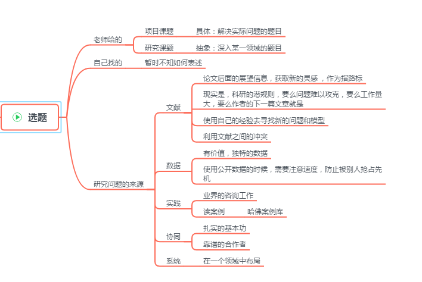

# 毕业篇|毕业课题是什么

## 前言

在上一篇《毕业篇|选题的那些事》中，我们了解了选题的一些方法论。那么这一篇，将主要解答题目本身的信息。

希望你可以透过题目看到本质。

全文思维导图图如下：

## 正文

### 背景介绍

本文我是在研读了王树义老师的**《毕业论文新手入坑手册》**进行的提炼。所以，强烈推荐先看一下，链接地址：<https://bookdown.org/wshuyi/intro-to-scientific-writings4/>

除了上文中的参考，我会结合自身的情况，进行相应的问题阐述与解答。

好了，准备开始吧！

### 问题与解答

#### 问题一：一般毕业课题的题目，都有哪几种？详细说一下。

如果你想学术一点的表述方式，那就有横向课题，纵向课题…….(对我们有什么用？)

所以，我觉得，题目本身没有错，错的是学术界太学术了，新手花时间在了不该纠结的事上，自己没有提高，反而浪费了时间。（现状本如此，何必惹烦恼！）

---

最简单的题目方式就是两种，**自己找的和老师给的**。

也可以表述为**主动式与被动式**。

接下来详细说一下这两种的内在关系。

> 第一种，自己找的。很简单，既然自己可以找到题目，并且能够做下去，那么说明研究水平还是相当不错的。剩下的就是时间到了，拿出自己的成果，貌似就完成了整个毕业过程。（其实就是完成了！）

> 第二种，老师给的。这个就会出现很多问题。首先，这个问题是否真的可以走下去？（不要说老师给的，都可以走下去，老师给的只是参考答案。）具体可以走下去不，决定了老师的能力。这也就是老师很重要，其实内在的是方向很重要，方向都错了，再使劲只是错的更远而已。
>
> 其次，老师给你的题目一般是有两种的。一种是直接出一个项目的内容，也就是做出来实实在在的东西，解决实实在在的问题。另一种是研究某一个东西，去看看这个东西到底是个什么东西。（感觉还是有点太学术，大白话一点，就是：一种是出事物，一种靠嘴吹。）

从学生的角度来看，自己找的就有那个**动力**去做好，毕竟是自己挖的坑，关键还跳进去了。老师给的就比较**艰难**了，因为认知的差距，你说的老师不以为然，老师说的你一知半解，这其中需要不断地采坑填坑，坚持下去也是有不少收获的。

顺便提一句，不管自己拿到的是什么课题，目的是**毕业**，做好这个题目，有自己的想法，并且已经实践验证，问题是不大的。（拿**成果**说话吧！）

#### 问题二：题目的问题本质是什么？即，源自何处？

这个问题，其实需要**自己去问出题老师**的，我也只能是借鉴老师的内容做出解答。（每一个专业的题目本质上都是不一样的！）

---

一般，不管是自己找，还是老师给的。我们都可以**抽象为：我们需要解决xxxx问题。**

好了，我们现在需要探讨的是问题的来源了，其实就算你问了老师，老师也并不会给你说的清楚，要是说清楚还要你做什么啊！貌似，这是学术的潜规则。老师看中的是结果，不会关心你是花了多长时间，做了多少事。（这就是现实！）

所以，在这里，我只提供王老师对于研究问题来源的描述，加上我自己的经历。

>1.文献得出这是一个研究问题。
>新手可能连文献怎么搜都还是个问题，还说从文献得到问题。开玩笑了啊！
>一般文献中的问题，就是最后的总结与展望，或者是结论部分。
>
>这里有一个坑，如果这个东西都已经写出来了，被你看到了，那么别人也会看到啊！怎么确定有没有人已经解决出来，接着就是继续的文献查找。还有就是原作者都已经给你了这个方法可以试试，原作者是不是傻，自己没有试一下吗？所以说，文献看到的问题都是大问题，这不是新手的等级，咋们都是平凡人，只需要做平凡的事，也就是解决平凡的事！心大，害惨你！
>
>
>
>2.数据获得研究问题。
>只要可以保证这个数据，有价值。那么，这就有意思了。
>
>我来解释一下什么是数据，可以认为是某某用户行为的数据，对标的专业当然是数据分析啦！也可以是某某机密数据，对应的论文也是保密的。但是，毕业已经不是问题了！！！
>
>
>
>3.实践中获得研究问题。
>这里有一个前提，那就是实践。作为一个一直上了接近20年学的人而言，你给我到哪里找实践经验去。就算有，可靠吗？这是一个问题吗？有人是不是已经看到的。
>
>所以，实践获得问题。需要的是见识，对于业界的深刻洞见。已经超过上了多年学人的水平力。业界的大牛，你见不到，甚至给你电脑，连上网线，你都不知道百度出谁来……
>
>
>
>4.协同，找到研究问题。
>对标的合作者，不是业界的大牛，基本上这事就不靠谱。level不够！
>
>
>
>5.系统中寻找研究问题。
>思路很好，想在某一个系统中获得思路，解决问题。正常一般人一年需要到45岁左右。难度很大，已经超过了自己的认知了。

综上，最直接，最可能的问题来源就是导师手中的**实践或者数据**。其实协同也是可能的，但是大多数是不存在，你遇不到。小概率事件而已。

#### 问题三：浅谈我的课题，梳理一个看待题目的思路！

这个问题，我会比较**主观**的表述一些自己的看法与观点。或许，你看完不会有很任何收获，但是作为写作的我，我有很多收获。

先从我对于课题的**感觉**来说，并没有感觉某某课题有多么的牛，其实是我看不到。但是，我自己也不需要看到。我需要的是做好该做的事，不浪费我的每一天时间，That's all！

在我经历了本科毕业，马上又要准备研究生毕业的旅途中。这一路走来，都是我的自主能力发挥作用，并不需要某某驱使我去做什么事，什么时间做什么事，自己比任何人都清楚，相反外界带来的只是噪声，自己得不到成长。说这个，只想表达，课题是你的事，做的好不好，自己**摸心口**吧！

真实的世界里面，我的课题，其实现在还是一个**悬在空中**的东西。只能远观看看影子，时而明确，时而朦胧。我身边的大多数人也都是这番景象。突然，脑海中蹦出来一个字“**混**”。不知道是自己在混自己，还会谁在混自己。所以，在这时候，自己不去做一些对于自己有成长的事，那么时间就过去了。结果不仅没有，还留下了，自己的悔恨。

----

我的毕业课题，老师一直都在说做什么，做什么，但是每一次都没有给出一个明确的1,2,3…..(这需要自己悟，表示现在还没有悟到。)

一般的话，老师给出个什么思路啥的，那就看文献啊！看文献啊！看文献啊！（注意下时间成本，让我去文献堆中找灵感，我有病。）难道学生不应该看文献吗？一直看吗？方法与技巧，什么都没有，就是一个字：“看”。浪费时间而已。一年前，甚至是半年前，我可以做到，但是，现在我已经做不到了。我需要一个明确的内容与主题。（其实你看了，你花了时间，真正有用的信息有多少？自己可以算一下。）

上面两大段，表述的就是**课题的不确定性**。可能很多时候，很多事都是在不确定性下前行。所以，还是需要理性的看待。

---

所以，我会**看文献，梳理一个自己的思路流**。这其中的花费时间与自己的精力，反正是很大，可是不小！哪怕没有任何人关心，只要自己关心就够了！

好了，整理一下本问题的回答。先深刻的感受一下自己的对于课题的感觉，接着选择一个心态去对待，接着正视课题是个什么样子，接着做该做的事。仅此而已！

### 总结

毕业论文中的课题题目，专业 不一样，对应的也都不一样。但是**共同点**就是：这是自己的事。自己付出时间，花费精力，得到结论，得出成果。

题目的本质，也只是让我们在一开始的时候就理解题目的本意。也就是确定一些方向，别跑偏了。曾经作为新手的我，经常看文献，看的自己都不知道自己看啥，然而时间过去了。

所以，希望大家一定要重视**课题的题目本身**，其他的都是噪声。自己花时间是肯定的，最终感动一下自己也是必须的。

## 结束语

本文虽然只谈论了课题的题目本身，但是略有跑题。（渐渐地整个毕业篇的系列已经开始融为一体了！）

经过两篇关于毕业选题与题目本身的文章。我想，新手应该已经开始准备动手实践，动脑思考，献出自己的时间在课题上了。后续，我会将分享一些查阅文献的技巧，某些软件的讲解。敬请期待！

**PS:**在整个系列结束之前，我会邀请一些已经毕业了的伙伴，和还没有毕业的伙伴，一起来分享一下关于毕业论文的那些坑与自身的经历！期待：）

